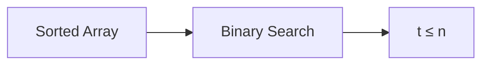

**Searching and Sorting: Theory Notes**
=====================================

### Introduction
-----------------

Searching and sorting are fundamental concepts in computer science, crucial for efficient data management. Searching involves finding a specific element or information within a dataset, while sorting requires arranging elements in a particular order.

### Core Concepts
-----------------

#### Searching Algorithms

*   **Linear Search**: A simple algorithm that checks each element of the array to find the target value.
    *   Time complexity: O(n)
*   **Binary Search**: A more efficient algorithm that divides the search space in half with each comparison.
    *   Time complexity: O(log n)

#### Sorting Algorithms

*   **Bubble Sort**: A simple sorting algorithm that repeatedly iterates through the array to swap adjacent elements if they are in the wrong order.
    *   Time complexity: O(n^2)
*   **Selection Sort**: An algorithm that repeatedly finds the smallest (or largest) element from unsorted part and puts it at the beginning (end).
    *   Time complexity: O(n^2)

### Key Formulas/Theorems
-------------------------

*   **Lower Bound for Searching**:
    $$
    t > \frac{n}{3} + 1
    $$
    where t is the number of comparisons and n is the number of elements.
*   **Upper Bound for Binary Search**:
    $$
    t ≤ n
    $$

### Problem Solving Patterns
---------------------------

#### Pattern 1: Lower Bound for Searching

When solving problems related to searching, consider using the lower bound formula to determine the minimum number of comparisons required.

```mermaid
graph LR
A[Given n] --> B[Apply Lower Bound Formula]
B --> C[t > (n/3) + 1]
```

#### Pattern 2: Binary Search

For problems involving searching in a sorted array, use binary search to optimize the solution.



### Examples with Solutions
---------------------------

**Example 1:** Find the minimum and maximum values in an array of size n using the fewest number of comparisons.

*   **Solution:**
    *   Compare first two elements.
    *   If they are equal, compare next element. Otherwise, move to next pair of elements.
    *   Repeat until the smallest and largest elements are found.
    *   Time complexity: O(n)

**Example 2:** Determine the minimum number of comparisons required to find a specific value in an array.

*   **Solution:**
    *   Use binary search to divide the search space in half with each comparison.
    *   Continue until the target value is found or the search space is empty.
    *   Time complexity: O(log n)

### Common Pitfalls
-------------------

*   **Overlooking Lower Bounds:** When solving searching problems, don't forget to apply lower bound formulas to determine the minimum number of comparisons required.
*   **Incorrectly Applying Binary Search:** Make sure to use binary search only when the input array is sorted in ascending or descending order.

### Quick Summary
-----------------

| Concept | Description | Time Complexity |
| --- | --- | --- |
| Linear Search | Checks each element in an array to find a target value. | O(n) |
| Binary Search | Divides the search space in half with each comparison to find a target value in a sorted array. | O(log n) |
| Lower Bound for Searching | The minimum number of comparisons required to find a specific value in an array. | ≥ (n/3) + 1 |

This comprehensive theory note covers searching and sorting algorithms, including linear search, binary search, bubble sort, and selection sort. It also provides key formulas and theorems, problem-solving patterns, examples with solutions, common pitfalls, and a quick summary for revision.