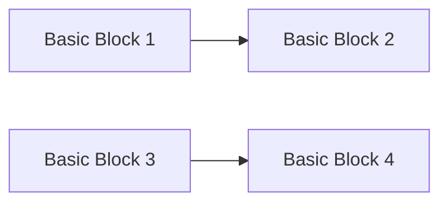
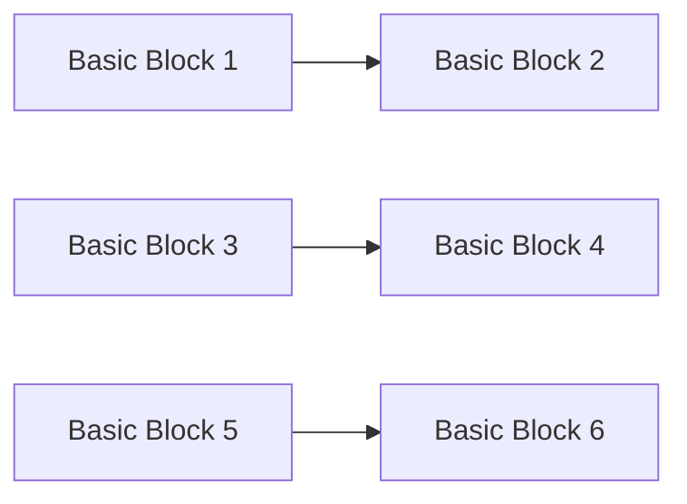
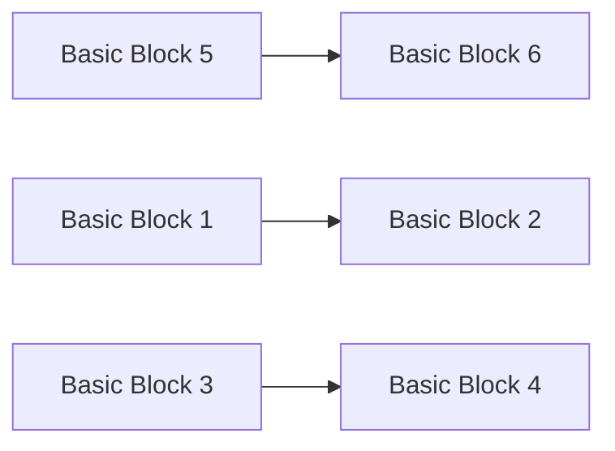

**Code Generation and Optimization**
=====================================

### Introduction
-----------------

Code generation and optimization are crucial components of a compiler's design. A compiler's primary function is to translate source code written in a high-level language into machine code that can be executed by the computer's processor. Code generation refers to the process of translating abstract syntax trees (ASTs) into machine code, while optimization involves rearranging or rewriting code to improve its performance, size, and complexity.

### Core Concepts
-----------------

#### Control Flow Graph (CFG)
A CFG is a graphical representation of a program's control flow. It consists of nodes representing basic blocks, which are sequences of instructions that have a single entry point and a single exit point. Edges represent the flow of control between these basic blocks.

**Example:**

#### Basic Blocks
A basic block is a sequence of instructions that have a single entry point and a single exit point. It is the smallest unit of code in a CFG.

**Example:**

```mermaid
graph LR;
    A[if (x > 5)] --> B[print("x is greater than 5")];
    C[endif] --> D[print("x is less than or equal to 5")];
```
#### Dominators and Dominator Trees
A dominator of a node in a CFG is the node that dominates all paths leading to that node. A dominator tree is a tree structure where each node represents a basic block, and each edge represents dominance.

**Example:**


#### Dominator Tree:



### Key Formulas/Theorems
-------------------------

*   **Dominator Tree:** For any two nodes `u` and `v`, if `dom(u) = v` then `u` dominates `v`.
*   **Dominance:** If a node `u` dominates another node `v`, it means that all paths from the entry point of the CFG to `v` pass through `u`.

### Problem Solving Patterns
-----------------------------

1.  **CFG Construction:** Given a program, construct its control flow graph.
2.  **Basic Block Identification:** Identify basic blocks in a given CFG.
3.  **Dominance Analysis:** Determine dominators and construct the dominator tree.

### Examples with Solutions
---------------------------

**Example:**

Given the following pseudo-code:

```assembly
1:  L t = -2
2:  if (t < 0) goto 4
3:  L t = 0
4:  if (t > 3) goto 6
5:  L t = 2
6:  print("t is greater than 3")
```

1.  **Construct CFG:** Create a control flow graph based on the given pseudo-code.
    ```mermaid
graph LR;
    A[Basic Block 1] --> B[Basic Block 2];
    C[Basic Block 3] --> D[Basic Block 4];
    E[Basic Block 5] --> F[Basic Block 6];
```
2.  **Identify Basic Blocks:** Identify the basic blocks in the CFG.
    *   Basic Block 1: L t = -2
    *   Basic Block 2: if (t < 0) goto 4
    *   Basic Block 3: L t = 0
    *   Basic Block 4: if (t > 3) goto 6
    *   Basic Block 5: L t = 2
    *   Basic Block 6: print("t is greater than 3")
3.  **Dominance Analysis:** Analyze dominance relationships between basic blocks.

### Common Pitfalls
-------------------

*   Failing to identify basic blocks correctly.
*   Misunderstanding the concept of dominators and the dominator tree.
*   Not considering all paths in a CFG during analysis.

### Quick Summary
-----------------

*   Control Flow Graph (CFG): A graphical representation of a program's control flow.
*   Basic Blocks: Sequences of instructions with a single entry point and a single exit point.
*   Dominators and Dominator Trees: Concepts used to analyze dominance relationships in a CFG.

Note that this is just an initial version, and the Theory Note will be updated as more questions are analyzed. 

Please let me know if you would like me to update or expand on any of these sections!