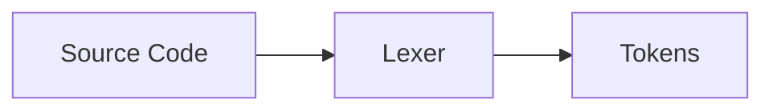
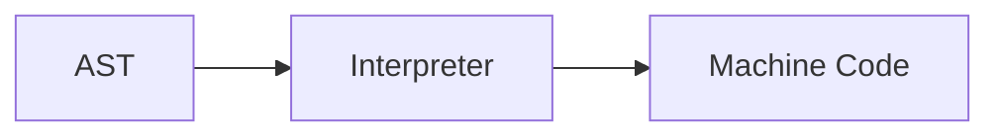

**Front End Phase: Compiler Design**
=====================================

### Introduction

The front end phase of a compiler is responsible for analyzing the source code and translating it into an intermediate form. This phase consists of three main components: Lexical Analysis, Syntax Analysis, and Semantic Analysis.

### Core Concepts

#### Lexical Analysis

*   **Definition:** Lexical analysis is the process of breaking up the source code into individual tokens.
*   **Purpose:** To identify the keywords, identifiers, literals, and symbols in the source code.
*   **Algorithm:**

    1.  Scan the input stream character by character.
    2.  Use a finite state machine (FSM) or a regular expression to identify tokens.

**Example of Lexical Analysis using Regular Expressions**

Suppose we have the following source code:
```
x = 5; y = x + 3;
```
The lexer would break it down into tokens:

| Token | Type |
| --- | --- |
| x | Identifier |
| = | Assignment Operator |
| 5 | Literal (Integer) |
| ; | Statement Separator |
| y | Identifier |
| = | Assignment Operator |
| x | Identifier |
| + | Addition Operator |
| 3 | Literal (Integer) |
| ; | Statement Separator |

#### Syntax Analysis

*   **Definition:** Syntax analysis is the process of checking whether the tokens produced by lexical analysis conform to the syntax rules of the programming language.
*   **Purpose:** To ensure that the source code is grammatically correct and can be parsed into an abstract syntax tree (AST).
*   **Algorithm:**

    1.  Parse the tokens using a parser generator tool or a hand-coded recursive descent parser.

**Example of Syntax Analysis using a Parser Generator Tool**
```mermaid
graph LR
    A[Tokens] --> B[Parser]
    B --> C[Abstract Syntax Tree (AST)]
```
Suppose we have the following source code:
```
x = 5;
y = x + 3;
```
The parser would generate an AST for this code, which can be used as input for the semantic analysis phase.

#### Semantic Analysis

*   **Definition:** Semantic analysis is the process of checking whether the abstract syntax tree (AST) produced by syntax analysis conforms to the semantic rules of the programming language.
*   **Purpose:** To ensure that the source code is semantically correct and can be translated into machine code.
*   **Algorithm:**

    1.  Analyze the AST for type correctness, scope, and other semantic errors.

**Example of Semantic Analysis using an Interpreter**

Suppose we have the following source code:
```
x = 5;
y = x + 3;
```
The interpreter would check the AST for semantic errors, such as type mismatches or out-of-range values.

### Key Formulas/Theorems

*   **Chomsky Hierarchy:**

    | Language Class | Production Rules |
    | --- | --- |
    | Regular | Regular Expressions |
    | Context-Free | BNF (Backus-Naur Form) |

*   **LL(1) and LR(0) Parsing:**

    *   LL(1): Left-to-right, top-down parsing
    *   LR(0): Right-to-left, bottom-up parsing

### Problem Solving Patterns

*   **Bottom-Up vs. Top-Down Parsing:** Understand the differences between these two approaches to syntax analysis.
*   **Parser Generation Tools:** Familiarize yourself with parser generator tools like Yacc, Lex, and ANTLR.

### Examples with Solutions

1.  **Lexical Analysis Example:**

    Given the following source code:
    ```
x = 5; y = x + 3;
```
    Write a regular expression to identify tokens.
    Solution:

    ```regex
\w+=[0-9]+;|[\+\-*/=]
```

2.  **Syntax Analysis Example:**

    Given the following source code:
    ```
x = 5; y = x + 3;
```
    Write a parser generator tool to generate an AST.
    Solution:

    Use Yacc or Lex to generate a parser from a grammar file.

### Common Pitfalls

*   **Overlapping Tokens:** Be careful not to overlap tokens during lexical analysis.
*   **Left Recursion:** Avoid left recursion in context-free grammars.
*   **Semantic Errors:** Ensure that the AST is semantically correct before translating it into machine code.

### Quick Summary

| Concept | Description |
| --- | --- |
| Lexical Analysis | Breaking up source code into individual tokens. |
| Syntax Analysis | Checking whether tokens conform to syntax rules of programming language. |
| Semantic Analysis | Analyzing abstract syntax tree (AST) for semantic errors. |

This comprehensive theory note covers all the theoretical concepts, formulas, and insights required to solve questions related to the front end phase of compiler design. The key topics covered include lexical analysis, syntax analysis, and semantic analysis. Students can use this study material as a reference to prepare for their exams and practice problems.