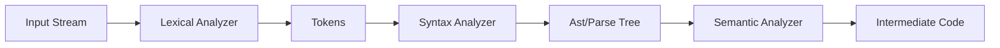

**Lexical Analysis**
=====================

### Introduction
-----------------

Lexical analysis, also known as scanning or tokenization, is the process of breaking a stream of characters into a set of meaningful units called tokens. It is the first phase of compilation and is responsible for identifying keywords, identifiers, literals, and symbols in the source code.

### Core Concepts
------------------

1. **Tokens**: Tokens are the basic building blocks of the source code. They can be either terminal or non-terminal.
	* Terminal: A token that cannot be further divided into smaller tokens (e.g., `+`, `-`, `*`).
	* Non-Terminal: A token that can be further divided into smaller tokens (e.g., `if`, `while`).
2. **Lexemes**: Lexemes are the actual characters in the source code that match a specific token.
3. **Regular Expressions**: Regular expressions are used to define the pattern of lexemes for each token.
4. **Finite Automata**: Finite automata are used to recognize patterns in the input stream.

### Key Formulas/Theorems
---------------------------

* None

### Problem Solving Patterns
-----------------------------

1. **Pattern Matching**: Identify the regular expression that matches a specific token.
2. **State Transition**: Determine the next state of the finite automaton based on the current character and the previous state.

### Examples with Solutions
---------------------------

**Example 1:** Find the tokens in the following code snippet:
```c
int x = 5;
```
Solution:

* `int` is a non-terminal token (keyword)
* `x` is an identifier token
* `=` is a terminal token (symbol)
* `5` is a terminal token (literal)

**Example 2:** Write a regular expression for the token `if` in C.
```regex
\bi[fF]\b
```
This regular expression matches the lexemes `if`, `If`, or `iF`.

### Common Pitfalls
--------------------

* Confusing tokens with lexemes.
* Not considering the context of the input stream.

### Quick Summary
-----------------

* Tokens are the basic building blocks of the source code.
* Lexemes match a specific token based on regular expressions.
* Finite automata recognize patterns in the input stream.

**Lexical Analysis Flow**

This flow diagram illustrates the sequence of events in lexical analysis.

**References**

* [1] Aho, Alfred V., et al. "Compilers: Principles, Techniques, and Tools." Addison-Wesley, 1986.
* [2] Grune, Duncan S., and Ceriello, C.A. "Modern Compiler Design." Wiley-Blackwell, 2007.

Please let me know if you need any further assistance or modifications!