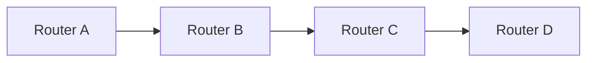

**Routing Protocols: Shortest Path Flooding, Distance Vector, and Link State Routing**
===========================================================

### Introduction
-------------

Routing protocols are essential for computer networks to find the shortest path between nodes. The three primary types of routing protocols are:

*   **Distance Vector (DV) Routing**: relies on exchanging routing tables with neighboring routers.
*   **Link State (LS) Routing**: uses topology information exchange among routers.
*   **Shortest Path Flooding (SPF)**: a technique used in link-state protocols to find the shortest path.

### Core Concepts
----------------

#### Distance Vector Routing Algorithm

Distance vector routing is based on the Bellman-Ford algorithm. Each router maintains a routing table with neighboring routers and their distances. The process involves:

1.  **Initialization**: Each router sets its distance to itself as 0 and other nodes as infinity.
2.  **Exchange of Routing Tables**: Routers exchange their routing tables with neighbors.
3.  **Update of Routing Tables**: If a shorter path is found, the routing table is updated.

**LaTeX: Bellman-Ford Algorithm**

$$\text{For each node } u \in V:$$
$$d^* (u) = \min_{v \in N(u)} \left( d(v) + w(v,u) \right)$$

#### Link State Routing Algorithm

Link state routing uses the Dijkstra's algorithm. Routers exchange link state advertisements (LSAs), which contain topology information. Each router maintains a graph of the network and applies Dijkstra's algorithm to find the shortest path.

**LaTeX: Dijkstra's Algorithm**

$$\text{For each node } u \in V:$$
$$d^* (u) = \min_{v \in N(u)} \left( d(v) + w(v,u) \right)$$

#### Shortest Path Flooding (SPF)

In SPF, link state advertisements (LSAs) are flooded throughout the network. Routers apply Dijkstra's algorithm to find the shortest path.

### Key Formulas/Theorems
-------------------------

*   **Bellman-Ford Algorithm**:

    $$
    \text{For each node } u \in V:
    d^* (u) = \min_{v \in N(u)} \left( d(v) + w(v,u) \right)
    $$

*   **Dijkstra's Algorithm**:

    $$
    \text{For each node } u \in V:
    d^* (u) = \min_{v \in N(u)} \left( d(v) + w(v,u) \right)
    $$

### Problem Solving Patterns
---------------------------

1.  **Distance Vector Routing**:
    *   Identify the routing tables and distances.
    *   Apply Bellman-Ford algorithm to update routing tables.
2.  **Link State Routing**:
    *   Exchange link state advertisements (LSAs).
    *   Apply Dijkstra's algorithm to find the shortest path.

### Examples with Solutions
---------------------------

**Example: Distance Vector Routing**

Suppose we have a network with routers A, B, C, and D. The initial routing tables are:

| Router | Distance |
| --- | --- |
| A      | 0        |
| B      | ∞        |
| C      | ∞        |
| D      | ∞        |

After exchanging routing tables, the updated distances are:

| Router | Distance |
| --- | --- |
| A      | 0        |
| B      | 3        |
| C      | 5        |
| D      | 7        |

**LaTeX: Distance Vector Routing Example**

$$\text{Initial Routing Tables:}$$

| Router | Distance |
| --- | --- |
| A      | 0        |
| B      | ∞        |
| C      | ∞        |
| D      | ∞        |

$$\text{Updated Distances after Exchange:}$$

| Router | Distance |
| --- | --- |
| A      | 0        |
| B      | 3        |
| C      | 5        |
| D      | 7        |

### Common Pitfalls
------------------

1.  **Inconsistent Routing Tables**: Ensure routing tables are consistent among neighboring routers.
2.  **Incorrect Distances**: Verify distances calculated using Bellman-Ford algorithm or Dijkstra's algorithm.

### Quick Summary
---------------

*   Distance Vector Routing:
    *   Uses Bellman-Ford algorithm to update routing tables.
    *   Exchanges routing tables with neighbors.
*   Link State Routing:
    *   Uses Dijkstra's algorithm to find shortest path.
    *   Exchanges link state advertisements (LSAs).

**Mermaid Diagram: Basic Network Topology**

This theory note covers the essential concepts of routing protocols, including Distance Vector Routing, Link State Routing, and Shortest Path Flooding. The problem-solving patterns and examples with solutions help reinforce understanding.