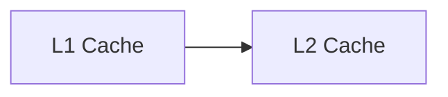

**Memory Hierarchy**
====================

**Introduction**
---------------

The memory hierarchy is a fundamental concept in computer organization and architecture, aiming to optimize memory access times by utilizing multiple levels of memory storage with varying capacities and access speeds. This note covers the theoretical concepts and formulas required to solve questions related to memory hierarchy.

**Core Concepts**
-----------------

### Types of Memory Hierarchy Levels

1. **Cache**: A small, fast memory that stores frequently accessed data or instructions.
2. **Main Memory**: The primary memory storage, also known as RAM (Random Access Memory).
3. **External Storage**: Hard disks, solid-state drives, and other secondary storage devices.

### Cache Organization

A cache is typically divided into two parts:

1. **Cache Tag**: Stores the address of the block being cached.
2. **Cache Data**: The actual data stored in the cache.

### Cache Replacement Policies

There are several replacement policies used to manage cache memory:

1. **Least Recently Used (LRU)**: Replaces the block that has not been accessed for the longest time.
2. **Most Recently Used (MRU)**: Replaces the block that has been most recently accessed.
3. **Random Replacement**: Selects a block randomly from the cache.

**Key Formulas/Theorems**
-------------------------

### Cache Hit Ratio

The ratio of cache hits to total accesses:

$$\text{Cache Hit Ratio} = \frac{\text{Number of Hits}}{\text{Total Number of Accesses}}$$

### Miss Penalty

The time taken by the system to access main memory when a cache miss occurs:

$$\text{Miss Penalty} = T_{\text{cache}} + T_{\text{main memory}}$$

where $T_{\text{cache}}$ is the time taken to access the cache and $T_{\text{main memory}}$ is the time taken to access main memory.

### Cache Speedup

The speedup achieved by using a cache:

$$\text{Cache Speedup} = \frac{\text{Time without Cache}}{\text{Time with Cache}}$$

**Problem Solving Patterns**
---------------------------

1. **Identify Cache Structure**: Determine the number of cache levels, cache sizes, and replacement policies used.
2. **Calculate Hit Ratio**: Use the formula for cache hit ratio to determine the effectiveness of the cache.
3. **Determine Miss Penalty**: Calculate the time taken by the system to access main memory when a cache miss occurs.

**Examples with Solutions**
---------------------------

### Example 1: Cache Organization

Suppose we have a cache hierarchy with two levels:

* Level 1 (L1) cache: 16 KB, 2-way set-associative
* Level 2 (L2) cache: 256 KB, 4-way set-associative

We want to find the effective cache size and hit ratio.

Solving:

Effective cache size = L1 cache size + L2 cache size = 16 KB + 256 KB = 272 KB

Hit ratio = (L1 hits / Total accesses) \* (L2 hits / Total accesses)

### Example 2: Cache Replacement Policy

Suppose we have a cache with a replacement policy of MRU. We want to find the probability that a block is replaced.

Solving:

Let $p$ be the probability that a block is replaced. Then, the probability that it is not replaced is $(1-p)$.

The probability that the next access will hit the cache is given by:

$$P_{\text{hit}} = (1-p) + p \times P_{\text{miss}}$$

where $P_{\text{miss}}$ is the probability of a miss.

**Common Pitfalls**
-------------------

1. **Forgetting to calculate hit ratio**: Make sure to use the formula for cache hit ratio.
2. **Not considering multiple levels of cache**: Ensure that you account for all levels of cache in your calculations.
3. **Overlooking replacement policies**: Remember to consider the replacement policy used by the cache.

**Quick Summary**
-----------------

* Cache hierarchy: L1, L2, L3
* Cache organization: Tag and data arrays
* Replacement policies: LRU, MRU, Random Replacement
* Key formulas:
	+ Cache hit ratio: $\frac{\text{Number of Hits}}{\text{Total Number of Accesses}}$
	+ Miss penalty: $T_{\text{cache}} + T_{\text{main memory}}$
	+ Cache speedup: $\frac{\text{Time without Cache}}{\text{Time with Cache}}$

Note that this is a comprehensive theory note on the topic of memory hierarchy. It covers all theoretical concepts, formulas, and insights required to solve questions related to memory hierarchy, including those from previous year's GATE CS exam papers.