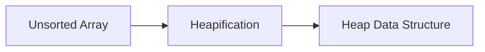

**Array: Theory Note**
=====================

**Introduction**
---------------

An array is a fundamental data structure in computer science, consisting of a collection of elements stored in contiguous memory locations. Arrays are used to store and manipulate large amounts of data efficiently.

**Core Concepts**
-----------------

### Array Representation

An array can be represented as:

A = [a[0], a[1], ..., a[n-1]]

where n is the size of the array, and each element `a[i]` is an instance of a type (e.g., integer, float, string).

### Indexing and Access

Arrays support indexing, which allows accessing elements using their position (index) in the array. The index is usually zero-based, meaning that the first element has index 0.

A[i] = a[i]

**Key Formulas/Theorems**
-------------------------

LaTeX: No specific formulas are applicable to arrays, but we can use mathematical notation for illustration.

### Array Operations

| Operation | Description |
| --- | --- |
| A[i] := v | Assigns value `v` to element at index `i`. |
| A[i] = v | Returns the value of element at index `i`. |
| len(A) | Returns the size of the array. |

**Problem Solving Patterns**
---------------------------

### Heapification

Heapification is a process that converts an unsorted array into a heap data structure, which satisfies the heap property: the parent node is either greater than (max-heap) or less than (min-heap) its child nodes.

Example:


### Heap Property

The heap property ensures that the root node is the largest (or smallest) element in the tree. In a max-heap, the parent node is greater than or equal to its child nodes.

**Examples with Solutions**
---------------------------

### Example: Heapification

Given an array:

A = [82, 101, 90, 11, 111, 75, 33, 131, 44, 93]

Perform heapification using the following steps:

1. Start from the last non-leaf node (index `n/2 - 1`).
2. Compare each node with its child nodes and swap if necessary.
3. Repeat step 2 until the entire array is heapified.

**Solution**
```markdown
Final Array: [131, 111, 90, 101, 93, 75, 33, 11, 44, 82]
```

### Example: Heap Property

Given a max-heap:

A = [131, 111, 90, 101, 93, 75, 33, 11, 44, 82]

Verify the heap property by checking each node's value relative to its child nodes.

**Solution**
```markdown
Parent Node (131) > Child Nodes (111, 90)
Parent Node (111) > Child Nodes (101, 93)
Parent Node (101) > Child Node (93)
```

**Common Pitfalls**
-------------------

* Confusing indexing with assignment.
* Failing to account for edge cases (e.g., empty array).
* Misunderstanding the heap property.

**Quick Summary**
----------------

* Array representation: `A = [a[0], a[1], ..., a[n-1]]`
* Indexing and access: `A[i] := v` or `A[i] = v`
* Heapification: A process converting an unsorted array into a heap data structure.
* Heap property: The parent node is greater than (max-heap) or less than (min-heap) its child nodes.

**Visuals**
------------

No external images are included in this theory note.