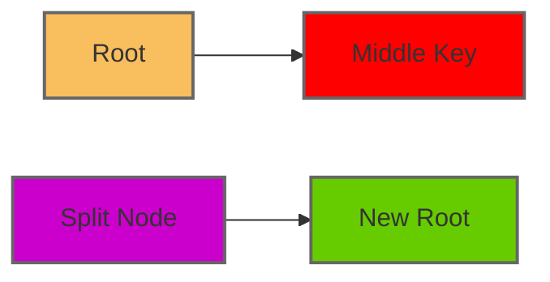

**Tree Data Structure**
=======================

### Introduction

A tree data structure is a hierarchical representation of nodes where each node has a value and zero or more child nodes. It's an essential data structure used for efficient storage, retrieval, and manipulation of large amounts of data.

### Core Concepts

#### Definition

*   A **tree** is defined as a set of nodes connected by edges.
*   Each node in the tree is associated with a unique value.
*   The tree has a single root node from which all other nodes are accessible through a finite sequence of edges (child-parent relationships).

#### Types of Nodes

*   **Internal nodes**: These nodes have child nodes. They can have any number of children except zero.
*   **Leaf nodes**: These nodes do not have any children. They represent the end points in the tree.

#### Tree Traversal

*   There are three primary types of tree traversal:
    *   **Inorder Traversal** (left-root-right): Visit left subtree, root node, and then right subtree.
    *   **Preorder Traversal** (root-left-right): Visit the root node first, then left subtree, and finally the right subtree.
    *   **Postorder Traversal** (left-right-root): Traverse left subtree followed by the right subtree, and finish with the root node.

### Key Formulas/Theorems

#### B-Tree Properties

*   A B-tree of order $m$ has the following properties:
    *   Each node in a B-tree contains at most $2i - 1$ keys (where $i$ is the level of the node) and at least $2i - 2$ keys.
    *   The root may contain one less key than other nodes.
    *   All leaf nodes are at the same level.

#### B-Tree Operations

*   **Insertion**: Insert a new key into the tree while maintaining the B-tree properties.
*   **Deletion**: Remove a key from the tree while preserving the B-tree properties.

### Problem Solving Patterns

1.  **Identify the type of problem**:
    *   Determine whether you need to find, insert, or delete data in the tree.
2.  **Apply traversal techniques**:
    *   Use inorder, preorder, or postorder traversal based on the specific requirements.
3.  **Manipulate the tree structure**:
    *   Perform rotations and splitting or merging operations as needed.

### Examples with Solutions

#### Example: Insertion in a B-Tree

Suppose we have a B-tree of order $m$ and we want to insert a new key $k$. We traverse down the tree until we find an empty slot or the node is full. If the root becomes full, we split it into two nodes and create a new root. Otherwise, we add the new key to the existing node.

#### Example: Deletion in a B-Tree

Suppose we have a B-tree of order $m$ and we want to delete a key $k$. We traverse down the tree until we find the node containing the key. If the node has more than two children (for non-root nodes), we replace it with its inorder successor. Otherwise, we merge the node with its sibling.

### Common Pitfalls

1.  **Incorrect B-tree operations**:
    *   Make sure to apply insertion and deletion correctly according to B-tree properties.
2.  **Inconsistent tree structure**:
    *   Verify that the tree remains valid after each operation.

### Quick Summary

*   Tree data structure: Hierarchical representation of nodes with edges.
*   Types of nodes: Internal (non-leaf) and leaf nodes.
*   Traversal techniques: Inorder, preorder, postorder.
*   B-tree properties:
    *   Order $m$
    *   Node keys between $2i - 2$ and $2i - 1$
    *   Root may have one less key than other nodes
    *   All leaf nodes at the same level