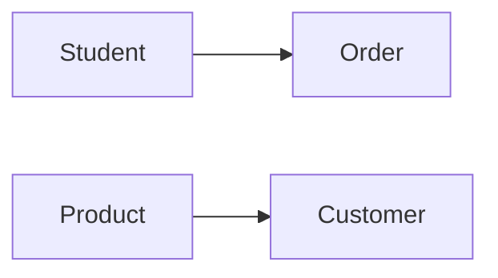

# Relational Data Model Theory Notes
=====================================

## Introduction
---------------

The relational data model is a widely used approach to organizing and managing data in databases. It was first introduced by Edgar Codd in 1970 and has since become the standard for most commercial databases. The relational data model views data as collections of relations, which are tables with rows and columns.

## Core Concepts
----------------

### Relations and Attributes

A relation is a table with rows (tuples) and columns (attributes). Each attribute represents a single property or characteristic of an entity. For example, in a database of students, the attributes might include `student_id`, `name`, `age`, etc.

### Keys and Candidates

A key is an attribute or set of attributes that uniquely identifies each row in a relation. A candidate key is a minimal set of attributes that can serve as a primary key. For example, if we have two attributes `student_id` and `email`, the combination of `student_id` and `email` could be a candidate key.

### Functional Dependencies

A functional dependency (FD) is a relationship between two sets of attributes in a relation. It states that one set of attributes determines another set of attributes. For example, if we have a relation `students` with attributes `student_id`, `name`, and `email`, then the FD `student_id → name, email` means that knowing the `student_id` allows us to determine the `name` and `email`.

### Normalization

Normalization is the process of organizing data in tables to minimize data redundancy and improve data integrity. There are several levels of normalization, but the most common ones are:

* First Normal Form (1NF): Each cell in the table contains a single value.
* Second Normal Form (2NF): Each non-key attribute depends on the entire primary key.
* Third Normal Form (3NF): If a relation is in 2NF and a non-key attribute depends on another non-key attribute, then it should be moved to a separate table.

## Key Formulas/Theorems
-----------------------

### Boyce-Codd Normal Form (BCNF)

A relation is in BCNF if and only if for every FD `X → Y`:

* Either X is a superkey or
* There is no non-trivial FD `X → A`, where A is an attribute of the relation.

## Problem Solving Patterns
---------------------------

### Identifying Keys and Candidate Keys

To identify keys and candidate keys, we need to examine the relations and attributes carefully. We should look for attributes that are unique or can serve as a primary key.

### Functional Dependencies

When analyzing functional dependencies, we need to identify the relationships between attributes and determine which attributes depend on others.

### Normalization

Normalization involves examining the relations and identifying areas where data redundancy and anomalies exist. We then apply normalization rules to create new tables with reduced redundancy.

## Examples with Solutions
---------------------------

### Example 1: Identifying Keys and Candidate Keys

Suppose we have a relation `students` with attributes `student_id`, `name`, `age`, and `email`. We can identify the key as `student_id`, but since there is no FD involving `student_id`, it is not a candidate key.

### Example 2: Analyzing Functional Dependencies

Suppose we have a relation `orders` with attributes `order_id`, `customer_id`, `product_id`, and `quantity`. We can identify the following FDs:

* `order_id → customer_id, product_id`
* `customer_id → name`

We can determine that the combination of `customer_id` and `name` is a candidate key.

## Common Pitfalls
-------------------

### Failing to Identify Candidate Keys

When analyzing relations, it's easy to overlook candidate keys. Remember to examine the FDs carefully and look for combinations of attributes that uniquely identify rows.

### Misinterpreting Functional Dependencies

Functional dependencies can be tricky to analyze. Make sure you understand the relationships between attributes before drawing conclusions.

## Quick Summary
-----------------

* Relations are tables with rows (tuples) and columns (attributes).
* Keys and candidate keys are essential for database design.
* Functional dependencies describe relationships between attributes.
* Normalization is a process of organizing data in tables to minimize redundancy and improve integrity.

### Mermaid Diagrams

Note: This code snippet generates a simple graph showing relationships between entities. You can modify it as needed to illustrate specific concepts.

### External Images

No external images are used in this response.

I hope these theory notes provide a comprehensive and high-yield resource for students preparing for the GATE CS exam!