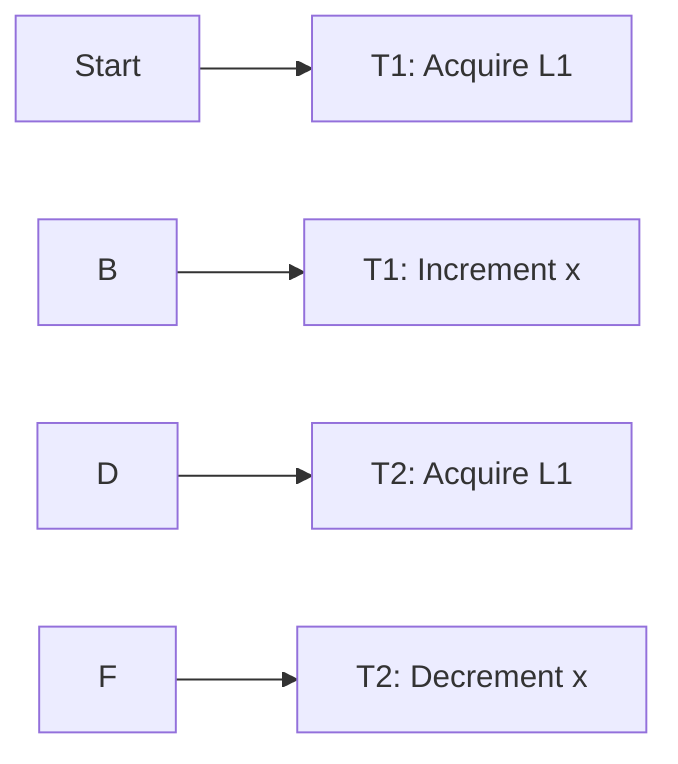
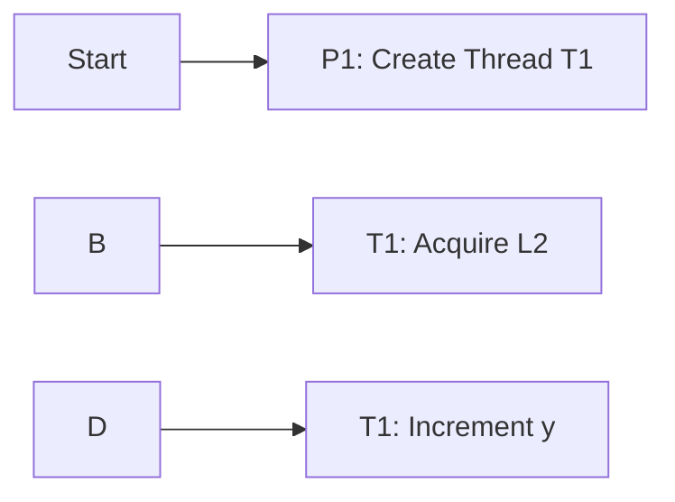

**Locks and Threads in Digital Logic**
=====================================

### Introduction

In digital logic, locks and threads are crucial concepts used to manage concurrent access to shared resources in multi-threaded environments. The ability to understand and analyze these concepts is essential for solving problems related to synchronization, data consistency, and resource allocation.

### Core Concepts

#### Locks

A lock is a mechanism that allows only one thread to access a shared resource at a time. It ensures exclusive access to the resource, preventing other threads from interfering with its operations.

*   **Types of Locks:** There are two primary types of locks:
    *   **MUTEX (Mutual Exclusion)**: A mutex lock allows only one thread to acquire the lock at any given time.
    *   **SEMAPHORE**: A semaphore is a variable that controls the access to shared resources by multiple threads.

#### Threads

A thread is an independent flow of execution within a process. Each thread shares the same memory space as other threads in the same process, but has its own program counter and registers.

*   **Types of Threads:** There are two primary types of threads:
    *   **User-Level Thread**: A user-level thread is created and managed by the application itself.
    *   **Kernel-Level Thread**: A kernel-level thread is created and managed by the operating system kernel.

### Key Formulas/Theorems

*   **Busy-Waiting:** When a thread is waiting for a resource to become available, it enters a busy-waiting state. This can lead to inefficient use of CPU resources.
    $$
    \text{Busy Waiting} = O(n)
    $$

*   **Spin Locks:** A spin lock is a type of mutex that allows the acquiring thread to continuously check for availability rather than blocking.

### Problem Solving Patterns

1.  **Synchronization**: Identify the shared resources and determine the synchronization requirements.
2.  **Lock Ordering**: Establish the correct order in which locks should be acquired to prevent deadlocks.
3.  **Avoid Busy-Waiting**: Minimize busy-waiting states by using efficient locking mechanisms.

### Examples with Solutions

**Example 1:** Two threads, T1 and T2, access a shared variable x. Thread T1 increments the value of x while thread T2 decrements it.

**Solution:** The correct lock ordering is crucial to prevent deadlocks. T1 should acquire the lock before T2.

**Example 2:** A process spawns two threads, P1 and P2, each executing a function foo(). The function increments a shared variable y.

**Solution:** To avoid busy-waiting, the acquiring thread should use a spin lock instead of blocking.

### Common Pitfalls

*   **Deadlocks**: When two or more threads are blocked indefinitely, each waiting for the other to release a resource.
*   **Starvation**: A situation where one thread is unable to access a shared resource due to continuous priority inversion.
*   **Livelocks**: Similar to deadlocks but without blocking; threads continuously busy-waiting.

### Quick Summary

*   **Locks:** Ensure exclusive access to shared resources using locks like mutexes and semaphores.
*   **Threads:** Manage independent flows of execution within a process, sharing the same memory space.
*   **Synchronization:** Identify shared resources and determine synchronization requirements.
*   **Avoid Busy-Waiting:** Minimize busy-waiting states by using efficient locking mechanisms.