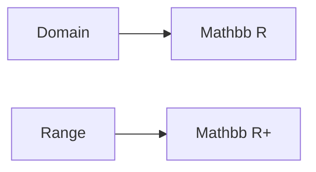

**Functions and Relations**
=========================

### Introduction
----------------

In Discrete Mathematics, a function is a relation between a set of inputs (domain) and a set of possible outputs (codomain). A function assigns each input exactly one output. Functions are fundamental in mathematics and computer science, used to model real-world phenomena and algorithms.

### Core Concepts
-----------------

#### Definition of Function

A function $f: A \to B$ is defined as:

* A relation between sets $A$ (domain) and $B$ (codomain)
* Each element $a \in A$ is associated with exactly one element $b \in B$
* The association can be represented as a set of ordered pairs $(a, b)$

#### Types of Functions
------------------------

* **Injective** (One-to-One): Different inputs have different outputs.
* **Surjective** (Onto): Each output has at least one input associated with it.
* **Bijective**: Both injective and surjective.

#### Composite Functions
-------------------------

The composition of two functions $f: A \to B$ and $g: B \to C$ is defined as:

$$
(g \circ f)(a) = g(f(a))
$$

### Key Formulas/Theorems
---------------------------

* **Function Composition**: $(g \circ f)(a) = g(f(a))$
* **Injective-Surjective Bijectivity**: If a function is both injective and surjective, it is bijective.

```latex
\begin{align*}
(f \circ g)(x) &= f(g(x)) \\
(f \circ g)^{-1}(y) &= g^{-1}(f^{-1}(y))
\end{align*}
```

### Problem Solving Patterns
---------------------------

When solving problems involving functions, consider the following:

1. **Check injectivity and surjectivity**: Ensure the function is both one-to-one and onto.
2. **Use composite functions**: Break down complex problems into simpler ones by using composition.

### Examples with Solutions
-------------------------

**Example 1**

Suppose $f: \mathbb{R} \to \mathbb{R}$ defined as:

$$
f(x) = x^2
$$

Find the domain and range of $f$.



**Solution**

* Domain: $\mathbb{R}$
* Range: $\mathbb{R}^+$ (non-negative real numbers)

**Example 2**

Consider the function $g: \mathbb{Z} \to \mathbb{Z}$ defined as:

$$
g(x) = x + 1
$$

Find the inverse of $g$.

```latex
\begin{align*}
g^{-1}(x) &= x - 1 \\
g(g^{-1}(x)) &= g(x-1) \\
&= (x-1) + 1 \\
&= x
\end{align*}
```

### Common Pitfalls
--------------------

1. **Misunderstanding injectivity and surjectivity**: Ensure the function is both one-to-one and onto.
2. **Not using composite functions**: Break down complex problems into simpler ones.

### Quick Summary
------------------

* Functions are relations between sets, associating each input with exactly one output.
* Types of functions: injective (one-to-one), surjective (onto), bijective (both).
* Composite functions: $(g \circ f)(a) = g(f(a))$.

Note: This is a comprehensive theory note covering the core concepts and problem-solving patterns for functions and relations in discrete mathematics.