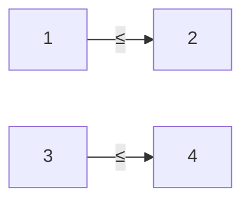

**Partial Orders and Lattices**
=====================================

### Introduction
-----------------

A partial order is a binary relation that satisfies certain properties, providing a way to compare elements within a set. A lattice is an ordered set with specific properties related to join and meet operations.

### Core Concepts
------------------

#### Partial Order
A partial order (PO) on a set S is a binary relation ≤ such that:

1.  Reflexivity: ∀x ∈ S, x ≤ x (every element is related to itself)
2.  Transitivity: If x ≤ y and y ≤ z, then x ≤ z
3.  Antisymmetry: If x ≤ y and y ≤ x, then x = y

#### Lattice
A lattice is an ordered set (L, ≤) with the following properties:

1.  Join operation (∨): For any two elements a, b ∈ L, there exists an element c such that a ∨ b = c, where a ≤ c and b ≤ c.
2.  Meet operation (∧): For any two elements a, b ∈ L, there exists an element d such that a ∧ b = d, where d ≤ a and d ≤ b.

#### Hasse Diagrams
A Hasse diagram is a graphical representation of a poset (partially ordered set), showing the ordering relation between elements. It's useful for visualizing and analyzing partial orders and lattices.

### Key Formulas/Theorems
-------------------------

*   **Dilworth's Theorem**: Every finite poset has a chain of maximum length if and only if its dual has an antichain of maximum size.
*   **The Fundamental Theorem of Lattices**: A lattice is distributive if and only if its join and meet operations satisfy the following equations:

    x ∧ (y ∨ z) = (x ∧ y) ∨ (x ∧ z)
    x ∨ (y ∧ z) = (x ∨ y) ∧ (x ∨ z)

### Problem Solving Patterns
-----------------------------

1.  **Counting Total Orders**: To find the number of total orders containing a given partial order, consider all possible linear extensions.
2.  **Analyzing Hasse Diagrams**: Study the structure and properties of the diagram to identify relationships between elements.

### Examples with Solutions
---------------------------

**Example 1**

Suppose we have a set {a, b, c} with the following partial order:

(a ≤ b) ∧ (c ≤ b)

Find all possible total orders on this set.

*   Solution: The only two possible total orders are:
    *   a ≤ b ≤ c
    *   c ≤ b ≤ a

**Example 2**

Consider a lattice L = ({a, b}, ∨, ∧) with the following operations:

a ∨ b = b
b ∨ a = a
a ∧ b = a
b ∧ a = b

Show that L is distributive.

*   Solution: To prove distributivity, we need to show that x ∧ (y ∨ z) = (x ∧ y) ∨ (x ∧ z).

    Let's take x = a, y = b, and z = a. Then:

    a ∧ (b ∨ a) = a
    (a ∧ b) ∨ (a ∧ a) = a

    Therefore, L is distributive.

### Common Pitfalls
--------------------

*   Confusing partial orders with total orders.
*   Failing to identify key properties of lattices, such as distributivity.
*   Not considering the Hasse diagram when analyzing posets.

### Quick Summary
-----------------

*   Partial orders have reflexive, transitive, and antisymmetric properties.
*   Lattices are ordered sets with join and meet operations satisfying specific equations.
*   Hasse diagrams represent partial orders graphically.
*   Distributivity is a key property of lattices.