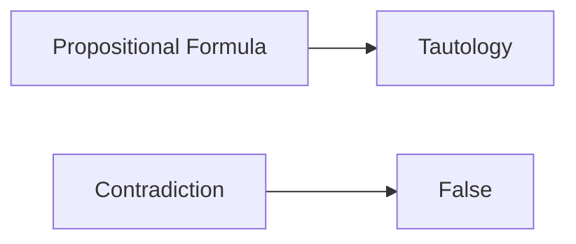

**Propositional and First-Order Logic**
=====================================

**Introduction**
---------------

Logic is a branch of mathematics that deals with reasoning, inference, and argumentation. Propositional logic (PL) and first-order logic (FOL) are fundamental frameworks for representing and manipulating logical statements.

**Core Concepts**
-----------------

### Propositional Logic (PL)

*   A **proposition** is a statement that can be either true or false.
*   A **propositional formula** is constructed from propositions using logical operators:
    *   $\neg$ (negation)
    *   $\wedge$ (conjunction, "and")
    *   $\vee$ (disjunction, "or")
    *   $\rightarrow$ (implication, "if-then")
    *   $\leftrightarrow$ (equivalence, "if-and-only-if")

**Key Formulas/Theorems**
-------------------------

### Tautologies

*   A **tautology** is a formula that is always true.
*   Example: $(p \rightarrow q) \equiv (\neg p \vee q)$
*   LaTeX: $\boxed{(p \rightarrow q) \equiv (\neg p \vee q)}$

### Contradictions

*   A **contradiction** is a formula that is always false.
*   Example: $p \wedge \neg p$
*   LaTeX: $\boxed{p \wedge \neg p}$

**Problem Solving Patterns**
---------------------------

### Analyzing Propositional Formulas

*   Use truth tables to determine the validity of propositional formulas
*   Apply logical equivalences (e.g., De Morgan's laws) to simplify or transform formulas

### First-Order Logic (FOL)

*   FOL extends PL by allowing quantification over variables:
    *   $\forall$ (universal quantifier, "for all")
    *   $\exists$ (existential quantifier, "there exists")

**Examples with Solutions**
---------------------------

### Example 1: Tautology

Is the following formula a tautology?

$\boxed{((P \rightarrow Q) \wedge (Q \rightarrow R)) \rightarrow (P \rightarrow R)}$

Solution:

*   Use truth tables to verify that the formula is always true
*   Alternatively, apply logical equivalences to transform the formula into a known tautology

### Example 2: Contradiction

Is the following formula a contradiction?

$\boxed{(\exists x P(x)) \wedge (\forall x \neg P(x))}$

Solution:

*   Use direct substitution or quantifier elimination to show that the formula is always false

**Common Pitfalls**
------------------

### Confusing Logical Operators

*   Be mindful of the order of operations (e.g., $\neg p \vee q$ vs. $p \rightarrow q$)

### Misapplying Quantifiers

*   Ensure correct usage of universal and existential quantifiers (e.g., $\forall x P(x)$ vs. $\exists x P(x)$)

**Quick Summary**
-----------------

*   Propositional logic: propositional formulas, tautologies, contradictions
*   First-order logic: quantification over variables, universal and existential quantifiers

### Visuals
-----------

**References**

*   [1] Enderton, H. (2002). *A Mathematical Introduction to Logic*. Academic Press.
*   [2] Lee, R. M. (2014). *Discrete Mathematics and Its Applications*.

Note: This is a starting point for your study note. You may add or remove content as per your requirements.