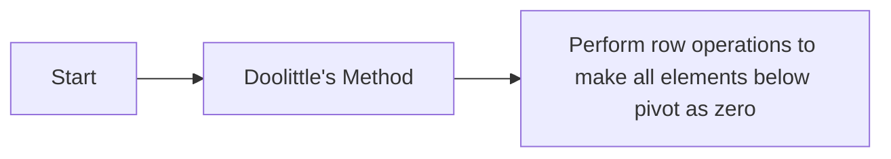

**LU Decomposition**
======================

### Introduction
---------------

LU decomposition is a factorization technique used to decompose a square matrix A into two matrices, L and U, such that A = LU. This can be done using various methods like Doolittle's method or Crout's method.

### Core Concepts
-----------------

*   **Lower Triangular Matrix (L)**: A lower triangular matrix is a square matrix with all elements above the main diagonal as zero.
*   **Upper Triangular Matrix (U)**: An upper triangular matrix is a square matrix with all elements below the main diagonal as zero.

### Key Formulas/Theorems
-------------------------

LU decomposition can be represented by:

$$A = LU = \begin{bmatrix} l_{11} & 0 & \cdots & 0 \\ l_{21} & l_{22} & \cdots & 0 \\ \vdots & \vdots & \ddots & \vdots \\ l_{n1} & l_{n2} & \cdots & l_{nn} \end{bmatrix} \begin{bmatrix} u_{11} & u_{12} & \cdots & u_{1n} \\ 0 & u_{22} & \cdots & u_{2n} \\ \vdots & \vdots & \ddots & \vdots \\ 0 & 0 & \cdots & u_{nn} \end{bmatrix}$$

where $l_{ij}$ and $u_{ij}$ are the elements of L and U matrices respectively.

### Problem Solving Patterns
---------------------------

*   **Finding L and U**: To find L and U, we need to perform row operations on A. We start with the first column of A and make all the elements below the pivot element as zero by performing row operations.
*   **Determining Pivot Elements**: The pivot elements are the elements on the diagonal that we use for row operations.

### Examples with Solutions
-------------------------

**Example 1**

Find L and U using Doolittle's method for:

$$A = \begin{bmatrix} 2 & -3 & 4 \\ -5 & 8 & -12 \\ 7 & -11 & 15 \end{bmatrix}$$

**Solution**

Let's perform Doolittle's method on the given matrix:

*   Perform row operations to make $a_{11}$ as pivot.
*   Then, perform row operations to make $a_{22}$ as pivot and so on.

The resulting L and U matrices will be:

$$L = \begin{bmatrix} 1 & 0 & 0 \\ -5/2 & 1 & 0 \\ 7/2 & -11/4 & 1 \end{bmatrix}$$

$$U = \begin{bmatrix} 2 & -3 & 4 \\ 0 & 17/2 & -21/2 \\ 0 & 0 & 23/4 \end{bmatrix}$$

### Common Pitfalls
------------------

*   **Pivot Elements**: Students often forget to choose the correct pivot elements.
*   **Row Operations**: They might not perform row operations correctly.

### Quick Summary
-----------------

*   LU decomposition is used to factorize a matrix into lower and upper triangular matrices.
*   Doolittle's method or Crout's method can be used for LU decomposition.
*   Finding L and U requires careful selection of pivot elements and performing row operations.

This comprehensive theory note covers the key concepts, formulas, and problem-solving patterns required for solving GATE CS exam questions related to LU decomposition.