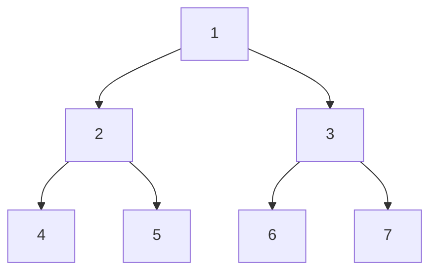

**Graph Traversal**
====================

**Introduction**
---------------

Graph traversal refers to the process of visiting each node in a graph or tree data structure, often for the purpose of searching, sorting, or manipulating nodes. Graph traversal algorithms are essential in many applications, including web crawlers, network analysis, and compiler design.

**Core Concepts**
-----------------

### Types of Traversal

There are two primary types of graph traversal:

*   **Preorder Traversal**: Visit a node before visiting its children.
*   **Postorder Traversal**: Visit a node after visiting its children.
*   **Inorder Traversal**: Visit the left subtree, then the current node, and finally the right subtree.

### Graph Representation

Graphs can be represented using various data structures, including:

*   **Adjacency Matrix**: A matrix where each entry `a[i][j]` represents the weight of edge between nodes `i` and `j`.
*   **Adjacency List**: A list of edges, where each edge is represented by its source node and target node.

**Key Formulas/Theorems**
-------------------------

There are no specific formulas or theorems for graph traversal. However, understanding time and space complexity is crucial:

*   **Time Complexity:**
    *   Preorder/Postorder traversal: O(n), where n is the number of nodes.
    *   Inorder traversal: O(n) for balanced trees; O(h) for unbalanced trees, where h is the height of the tree.
*   **Space Complexity:** O(h) in recursive implementations or O(w) in iterative implementations, where w is the width of the graph.

**Problem Solving Patterns**
---------------------------

1.  **Use Recursion:**

    *   Identify the base case (e.g., an empty tree).
    *   Define the recursive step (e.g., traverse left subtree, then right subtree).
2.  **Implement Iterative Traversal:**

    *   Use a stack or queue to store nodes.
    *   Iterate through the nodes and perform operations as needed.

**Examples with Solutions**
---------------------------

### Preorder Traversal

Suppose we have the following tree:

```
     1
   /   \
  2     3
 / \   / \
4   5 6   7
```

To traverse this tree in preorder, we start at node 1 and visit its children in order.



The traversal sequence is: 1, 2, 4, 5, 3, 6, 7.

### Postorder Traversal

Similarly, for postorder traversal:


The traversal sequence is: 4, 5, 2, 6, 7, 3, 1.

**Common Pitfalls**
------------------

*   **Not considering edge cases:** Ensure your algorithm handles empty graphs or trees.
*   **Incorrectly implementing iterative traversal:** Use a stack or queue correctly to avoid deadlocks.

**Quick Summary**
-----------------

*   Graph traversal is essential in computer science.
*   Understand types of traversal (preorder, postorder, inorder) and their applications.
*   Learn to represent graphs using adjacency matrices or lists.
*   Develop problem-solving skills using recursion and iterative approaches.