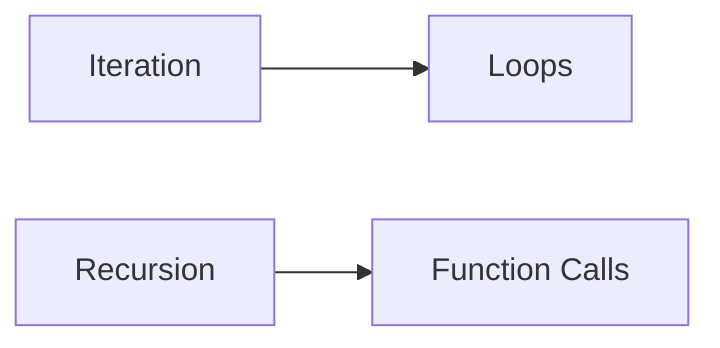

**Recursion**
================

### Introduction

Recursion is a fundamental concept in computer science where a function calls itself repeatedly until it reaches a base case that stops the recursion. It's a powerful tool for solving problems that have a recursive structure, such as tree traversals, sorting algorithms, and more.

### Core Concepts

#### Recursion vs Iteration

Recursion and iteration are two different approaches to solve problems in programming. While iteration uses loops to repeat a set of instructions, recursion uses function calls to break down the problem into smaller sub-problems.



#### Base Case

The base case is the condition that stops the recursion. It's a critical component of recursive functions, as it ensures that the function terminates eventually.

**Theorem:** A recursive function must have a base case to avoid infinite recursion.

#### Recursive Function Structure

A typical recursive function has two components:

1.  The recursive call: This is where the function calls itself with smaller inputs until it reaches the base case.
2.  The solution: This is where the function returns the final result or solution to the problem.

**Example:**

```c
int factorial(int n) {
    if (n == 0) { // Base Case
        return 1;
    } else {
        return n * factorial(n-1); // Recursive Call
    }
}
```

### Key Formulas/Theorems

*   There are no specific formulas for recursion, but understanding the recursive function structure and base case is essential.

### Problem Solving Patterns

When solving problems using recursion, follow these steps:

1.  Identify the problem's recursive structure.
2.  Determine the base case(s).
3.  Break down the problem into smaller sub-problems (recursive calls).
4.  Combine the solutions to the sub-problems to obtain the final result.

**Example:**

Consider a binary tree where each node has two children, left and right. Write a recursive function to traverse the tree in pre-order (root -> left -> right).

```c
typedef struct Node {
    int data;
    struct Node* left;
    struct Node* right;
} Node;

void preorder(Node* root) {
    if (root == NULL) { // Base Case
        return;
    }
    printf("%d ", root->data); // Print Root
    preorder(root->left); // Recursive Call for Left Subtree
    preorder(root->right); // Recursive Call for Right Subtree
}
```

### Examples with Solutions

1.  **Factorial Function:**

```c
int factorial(int n) {
    if (n == 0) { // Base Case
        return 1;
    } else {
        return n * factorial(n-1); // Recursive Call
    }
}

// Test the function
int main() {
    int result = factorial(5);
    printf("Factorial of 5: %d\n", result);
    return 0;
}
```

2.  **Binary Search in a Sorted Array:**

```c
int binarySearch(int arr[], int n, int target) {
    if (n == 0 || arr[0] > target) { // Base Case
        return -1; // Target not found
    } else if (arr[n-1] < target) { // Target is out of range
        return -1;
    }
    
    if (arr[0] == target) {
        return 0; // Target at the beginning of array
    }

    int mid = n / 2;
    if (arr[mid] == target) {
        return mid + 1; // Target found
    } else if (target < arr[mid]) { // Search in left half
        return binarySearch(arr, mid, target);
    } else { // Search in right half
        int index = binarySearch(arr + mid + 1, n - mid - 1, target);
        if (index != -1) {
            return index + mid + 1; // Target found
        }
    }

    return -1; // Target not found
}

// Test the function
int main() {
    int arr[] = {2, 5, 8, 12, 16};
    int n = sizeof(arr) / sizeof(arr[0]);
    int target = 12;
    int result = binarySearch(arr, n, target);
    if (result != -1) {
        printf("Target found at index %d\n", result);
    } else {
        printf("Target not found\n");
    }
    return 0;
}
```

### Common Pitfalls

*   **Infinite Recursion:** Failing to include a base case can lead to infinite recursion, causing the function to call itself indefinitely.
*   **Incorrect Recursive Call Order:** Incorrectly ordering recursive calls can result in incorrect solutions or even infinite recursion.

### Quick Summary

| Topic | Description |
| --- | --- |
| Recursion | Function calls itself repeatedly until it reaches a base case. |
| Base Case | The condition that stops the recursion, ensuring the function terminates eventually. |
| Recursive Function Structure | Typically consists of a recursive call and a solution component. |

This comprehensive theory note covers all theoretical concepts, formulas, and insights required to solve the provided source questions and similar future questions on recursion.