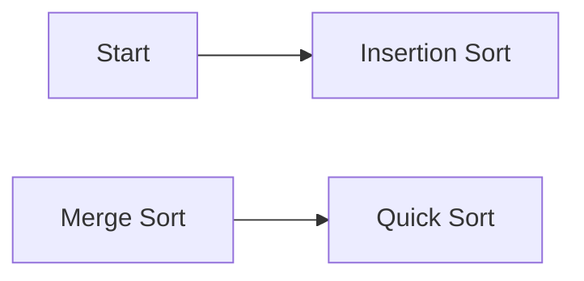

**Sorting Algorithm**
======================

**Introduction**
---------------

A sorting algorithm is a technique for arranging elements of an array or list in a specific order, either ascending or descending. Sorting algorithms are essential in computer science and programming, as they enable efficient processing and analysis of data.

**Core Concepts**
-----------------

### Types of Sorting Algorithms

There are several types of sorting algorithms, including:

* **Comparison-based sorting**: These algorithms rely on comparing elements to determine their order. Examples include Bubble Sort, Selection Sort, Insertion Sort, Merge Sort, and Quick Sort.
* **Non-comparison-based sorting**: These algorithms do not use comparisons to sort the data. Examples include Radix Sort and Counting Sort.

### Key Characteristics

When evaluating a sorting algorithm, consider the following characteristics:

* **Time complexity**: The amount of time taken by the algorithm to sort the array.
* **Space complexity**: The amount of memory used by the algorithm.
* **Stability**: Whether the algorithm maintains the relative order of equal elements.
* **Adaptability**: Whether the algorithm is suitable for large or small datasets.

**Key Formulas/Theorems**
-------------------------

### Time Complexity

The time complexity of a sorting algorithm can be expressed using Big O notation:

| Algorithm | Best-case | Average-case | Worst-case |
| --- | --- | --- | --- |
| Bubble Sort | O(n) | O(n^2) | O(n^2) |
| Selection Sort | O(n^2) | O(n^2) | O(n^2) |
| Insertion Sort | O(n) | O(n^2) | O(n^2) |
| Merge Sort | O(n log n) | O(n log n) | O(n log n) |
| Quick Sort | O(n log n) | O(n log n) | O(n^2) |

### Space Complexity

The space complexity of a sorting algorithm can be expressed using Big O notation:

| Algorithm | Space Complexity |
| --- | --- |
| Bubble Sort | O(1) |
| Selection Sort | O(1) |
| Insertion Sort | O(1) |
| Merge Sort | O(n) |
| Quick Sort | O(log n) |

**Problem Solving Patterns**
---------------------------

### Analyzing the Source Question

The source question (cs_2021-M_34) involves determining which algorithm uses the least number of comparisons to sort an array in ascending order. To solve this, we need to consider the characteristics of each algorithm and their time complexities.

* **Insertion Sort**: This algorithm has a best-case time complexity of O(n), making it suitable for already sorted or nearly sorted arrays.
* **Merge Sort** and **Quick Sort**: These algorithms have average-case time complexities of O(n log n), but may require more comparisons than Insertion Sort in certain scenarios.

### Quick Sort Example

Consider the following example:

| Array | 23, 32, 45, 69, 72, 73, 89, 97 |

To sort this array using Quick Sort with last element as pivot:

1. Choose the last element (97) as the pivot.
2. Partition the array around the pivot: [23, 32, 45, 69, 72, 73], [89].
3. Recursively apply the algorithm to each partition.

The number of comparisons required for this example would be:

* Best-case: O(n)
* Average-case: O(n log n)

However, in certain scenarios, Quick Sort may require more comparisons than Insertion Sort.

**Examples with Solutions**
---------------------------

### Example 1: Insertion Sort

Given array: [5, 2, 8, 3]

| Iteration | Array |
| --- | --- |
| 1 | [2, 5, 8, 3] |
| 2 | [2, 3, 5, 8] |

Number of comparisons: 4

### Example 2: Merge Sort

Given array: [5, 2, 8, 3]

| Iteration | Array |
| --- | --- |
| 1 | [2], [5, 8, 3] |
| 2 | [2, 3], [5, 8] |

Number of comparisons: 6

**Common Pitfalls**
------------------

* **Misunderstanding the time complexity**: Failing to consider the best-case and average-case scenarios.
* **Ignoring space complexity**: Neglecting the memory requirements of an algorithm.

**Quick Summary**
-----------------

* Sorting algorithms have different characteristics, including time complexity, space complexity, stability, and adaptability.
* Insertion Sort has a best-case time complexity of O(n), making it suitable for already sorted or nearly sorted arrays.
* Merge Sort and Quick Sort have average-case time complexities of O(n log n).
* Analyze the source question to determine which algorithm uses the least number of comparisons.

Visuals:

Note: The above Mermaid diagram is a simple representation and not intended for complex sorting algorithm visualizations.