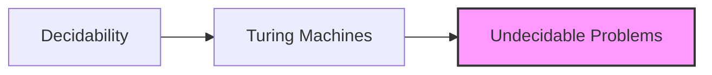

# Decidability
====================================

## Introduction
---------------

Decidability is a fundamental concept in the Theory of Computation, dealing with the ability to determine whether a given problem has a solution or not. In other words, it's about determining whether a decision can be made or if it's impossible.

## Core Concepts
-----------------

### Turing Machines (TMs)
A TM is an abstract machine that can read and write symbols on an infinite tape divided into cells, each containing a symbol from the alphabet. The TM has a finite control unit that moves along the tape, reading and writing symbols according to a set of rules.

**TM Components**

*   Tape: Infinite sequence of cells, each containing a symbol.
*   Head: Moves along the tape, reading and writing symbols.
*   Finite Control Unit (FCU): Makes decisions based on current state and input.

### Decidable Problems
A problem is decidable if there exists a TM that can solve it in finite time. This means the TM will eventually halt with either an "accept" or "reject" decision.

**Decidability Example**

*   Given a string, decide whether it's a palindrome (reads the same forwards and backwards).
	+   A decider TM can solve this problem by comparing characters from both ends of the string, moving towards the center. If all pairs match, it accepts; otherwise, it rejects.

## Key Formulas/Theorems
---------------------------

### Turing Machine Hierarchy

$ P \subseteq NP \subseteq EXPTIME \subseteq EXPSPACE \subseteq PSPACE $

*   $P$: Polynomial Time
*   $NP$: Nondeterministic Polynomial Time
*   $EXPTIME$: Exponential Time
*   $EXPSPACE$: Exponential Space
*   $PSPACE$: Polynomial Space

## Problem Solving Patterns
---------------------------

### Determining Undecidability
To prove a problem is undecidable, we need to show that there's no TM that can solve it in finite time. One way to do this is by reducing an already known undecidable problem to the given one.

**Example Reduction**

*   Suppose we want to prove that deciding whether a string is a palindrome (given above) is undecidable.
	+   We reduce the Halting Problem (undecidable) to this problem: given a TM $M$ and input $w$, if $M$ halts on $w$, then $w$ should be a palindrome. Otherwise, it's not.
		-   If we could decide palindromes, we could solve the Halting Problem, which is impossible.

## Examples with Solutions
---------------------------

### Q1: Undecidability

*   Given a TM M, decide if M accepts all strings.
	+   **Undecidable**: This problem is equivalent to the Halting Problem. If we had an algorithm to determine whether $M$ accepts all strings, we could solve the Halting Problem by giving it any TM and input, asking if $M$ halts on that input.
*   Given a TM M, decide if M takes more than 1073 steps on every string.
	+   **Decidable**: We can construct a TM that simulates $M$'s execution for up to 1074 steps. If it finishes within the limit, it accepts; otherwise, it rejects.
*   Given two TMs 1M and 2M, decide if their language equivalence is the same (L(M) = L(M')).
	+   **Undecidable**: This problem reduces to the Halting Problem. We can construct a TM that runs both $M$'s in parallel and accepts if they produce the same output for all inputs.
*   Given a TM M, decide if its language is regular (L(M) = regular language).
	+   **Undecidable**: This problem reduces to the Post Correspondence Problem (PCP), which is undecidable. We can construct a TM that produces instances of PCP based on $M$'s output.

## Common Pitfalls
------------------

*   Confusing decidability with solvability: just because a problem is decidable doesn't mean it's easy to solve; some problems may be computationally infeasible.
*   Failing to reduce undecidability properly: when reducing an already known undecidable problem, make sure the reduction preserves all essential properties.

## Quick Summary
-----------------

| **Concept** | **Description** |
| --- | --- |
| Decidability | Ability to determine whether a decision can be made or if it's impossible. |
| Turing Machines (TMs) | Abstract machines that read and write symbols on an infinite tape, solving problems by making decisions based on current state and input. |
| Undecidable Problems | Problems for which no TM exists to solve them in finite time; usually proved undecidable by reducing a known problem. |

### Mermaid Diagram

### References

*   For further reading on decidability and Turing machines, refer to the following sources:
    *   "Computational Complexity: A Modern Approach" by Sanjeev Arora and Boaz Barak
    *   "Introduction to Automata Theory, Languages, and Computation" by John Hopcroft, Rajeev Motwani, and Jeffrey Ullman