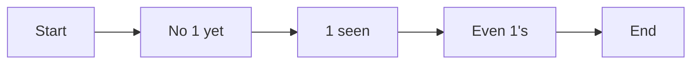

**Theory of Computation: Regular Expressions and Finite Automata, Context-Free Grammars, and Push Down Automata**
===========================================================

**Introduction**
---------------

The Theory of Computation deals with the study of computation itself. It encompasses various models of computation, including regular expressions, finite automata, context-free grammars, and pushdown automata. These concepts are crucial in understanding the limitations and capabilities of different computational models.

**Core Concepts**
-----------------

### Regular Expressions

*   A regular expression is a pattern used to match strings.
*   It consists of characters, operators, and special symbols.
*   Some common operators include concatenation (\), Kleene star ( ), and union (|).

### Finite Automata

*   A finite automaton (FA) is a 5-tuple M = (Q, Σ, δ, q0, F), where:
    *   Q is the set of states.
    *   Σ is the alphabet.
    *   δ is the transition function.
    *   q0 is the initial state.
    *   F is the set of accepting states.

### Context-Free Grammars

*   A context-free grammar (CFG) is a 4-tuple G = (V, T, P, S), where:
    *   V is the set of non-terminal symbols.
    *   T is the set of terminal symbols.
    *   P is the set of production rules.
    *   S is the start symbol.

### Push Down Automata

*   A pushdown automaton (PDA) is a 7-tuple M = (Q, Σ, Γ, δ, q0, Z, F), where:
    *   Q is the set of states.
    *   Σ is the input alphabet.
    *   Γ is the stack alphabet.
    *   δ is the transition function.
    *   q0 is the initial state.
    *   Z is the start symbol (initial stack content).
    *   F is the set of accepting states.

**Key Formulas/Theorems**
-------------------------

### Pumping Lemma for Regular Languages

*   If L is a regular language, then there exists an integer p (the pumping length) such that any string w in L with |w| ≥ p can be written as w = xyz, where:
    *   |y| ≥ 1
    *   |xy| ≤ p
    *   For all i ≥ 0, xy^iz is also in L.

### Myhill-Nerode Theorem

*   Two regular languages are equivalent if and only if their Nerode equivalence relation is the same.

**Problem Solving Patterns**
---------------------------

### Regular Expressions

*   Use the Kleene star to match zero or more occurrences of a pattern.
*   Utilize the union operator to combine two patterns into one.

### Finite Automata

*   Construct a DFA by converting an NFA using the powerset construction algorithm.
*   Apply the Myhill-Nerode theorem to determine language equivalence.

### Context-Free Grammars

*   Convert a CFG to a PDA using the grammar simulation method.
*   Use the pumping lemma for regular languages to prove non-regularity.

**Examples with Solutions**
---------------------------

### Example 1: DFA Construction

Construct a DFA that accepts strings over {0, 1} with an even number of 1's.

Solution:

*   States: {No 1 yet, 1 seen, Even 1's}
*   Alphabet: {0, 1}
*   Transition function:
    *   δ(No 1 yet, 0) = No 1 yet
    *   δ(No 1 yet, 1) = 1 seen
    *   δ(1 seen, 0) = No 1 yet
    *   δ(1 seen, 1) = Even 1's
    *   δ(Even 1's, 0) = Even 1's
    *   δ(Even 1's, 1) = Even 1's

### Example 2: Pumping Lemma Application

Prove that the language L = {anb^n | n ≥ 0} is not regular using the pumping lemma.

Solution:

*   Assume L is regular.
*   By the pumping lemma, there exists an integer p such that any string w in L with |w| ≥ p can be written as w = xyz, where:
    *   |y| ≥ 1
    *   |xy| ≤ p
    *   For all i ≥ 0, xy^iz is also in L.
*   Let w = a^p b^p, which is in L.
*   Since |w| ≥ p, there exists y such that |y| ≥ 1 and |xy| ≤ p.
*   By the pumping lemma, xy^ib is also in L for all i ≥ 0.
*   However, this leads to a contradiction since a^p b^p does not contain any substring of the form a^k b^k with k > p.

**Common Pitfalls**
------------------

### Regular Expressions

*   Misusing the union operator (|) instead of concatenation (\).
*   Failing to escape special characters in regular expressions.

### Finite Automata

*   Confusing DFA and NFA or vice versa.
*   Incorrectly applying the Myhill-Nerode theorem.

**Quick Summary**
-----------------

*   Regular Expressions: patterns for matching strings, operators (concatenation, Kleene star, union).
*   Finite Automata: 5-tuple (Q, Σ, δ, q0, F), DFA/NFA conversion.
*   Context-Free Grammars: 4-tuple (V, T, P, S), CFG to PDA conversion using grammar simulation method.
*   Push Down Automata: 7-tuple (Q, Σ, Γ, δ, q0, Z, F).

Note: The provided Quick Summary is a concise list of key concepts. It's essential for students to delve into each topic with more detail and practice solving problems related to regular expressions, finite automata, context-free grammars, and pushdown automata.